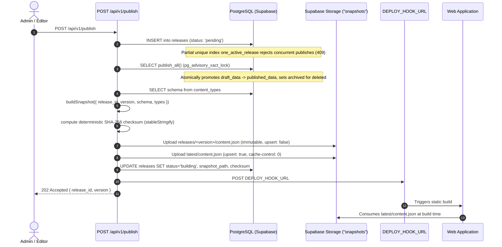

# Ananta CMS Admin — Backend Architecture & Operations Guide

Ananta CMS is a headless Content Management System with atomic publishing, optimistic concurrency, role-based access control (RBAC), and static site deploy integration. Built on **Next.js 16** (App Router, Node.js runtime) and **Supabase** (PostgreSQL, Storage, Auth).

---

## 1. Environment Configuration

Copy the example environment file and fill in required secrets:

```bash
cp .env.example .env.local
```

### Environment Variables

| Variable | Scope | Description |
|---|---|---|
| `NEXT_PUBLIC_SUPABASE_URL` | Public / Client & Server | Supabase project URL (`https://<project>.supabase.co`) |
| `NEXT_PUBLIC_SUPABASE_PUBLISHABLE_KEY` | Public / Client & Server | Supabase publishable anon key (used by `@supabase/ssr` with session cookies) |
| `SUPABASE_SECRET_KEY` | Server Only | Supabase service role secret key (bypasses RLS for atomic publish, audit logs, storage uploads) |
| `DEPLOY_HOOK_URL` | Server Only | Webhook URL triggered after snapshot upload (e.g., Vercel Deploy Hook, GitHub Actions webhook) |
| `PUBLIC_SITE_URL` | Server Only | Base URL of the live frontend consumption site (e.g. `https://ananta.fest`) |
| `CRON_SECRET` | Server Only | Bearer secret for authenticated invocations of `GET /api/v1/cron/verify` |

---

## 2. Getting Started & Development

```bash
# Install dependencies
npm install

# Run TypeScript typecheck
npx tsc --noEmit

# Run ESLint
npm run lint

# Run automated unit & integration test suite (Vitest)
npm test

# Start Next.js development server
npm run dev
```

---

## 3. How the Publishing Pipeline Works

Publishing in Ananta CMS is designed for sub-second execution (well under 10 seconds), zero downtime, and complete atomic isolation.



### Step-by-Step Breakdown

1. **Locking & Initialization**:
   - `requireRole(["admin", "editor"])` ensures authorization.
   - Inserts row into `releases` with `status: 'pending'`. The partial unique index `one_active_release` on PostgreSQL guarantees that only one release can be in flight (`pending` or `building`). Concurrent attempts immediately receive `409 PUBLISH_IN_PROGRESS`.

2. **Atomic Database Promotion (`publish_all`)**:
   - Executes PostgreSQL function `publish_all()` inside a transaction with `pg_advisory_xact_lock('ananta_publish')`.
   - Items with `is_deleted = true` are archived and removed from `published_data`.
   - Items with `has_unpublished_changes = true` have `published_data = draft_data`, `status = 'published'`, and `has_unpublished_changes = false`.

3. **Deterministic Snapshot Assembly**:
   - `buildSnapshot()` merges all `content_types` definitions (as `schema`) and all published items (as `types`).
   - Every content type appears in both `schema` and `types` (empty arrays if no items).
   - Soft-deleted items are omitted.
   - Computes SHA-256 `checksum` using `stableStringify` (recursive key sorting) so Postgres jsonb key reordering does not affect hash integrity.

4. **Storage Uploads**:
   - Uploads to public bucket `snapshots`:
     - `releases/<version>/content.json` (immutable history).
     - `latest/content.json` (canonical build source).

5. **Deploy Hook & Verification**:
   - Release status changes to `building`.
   - POST to `DEPLOY_HOOK_URL` triggers the frontend rebuild.
   - If `DEPLOY_HOOK_URL` is missing or placeholder, the endpoint logs a warning, remains `building`, and returns 202 without crashing.

6. **Status Confirmation (Lazy & Scheduled)**:
   - When `GET /releases/:id/status` or `GET /cron/verify` runs, it fetches `${PUBLIC_SITE_URL}/version.json?t=${Date.now()}` (`cache: "no-store"`).
   - If `version.json` has `version >= release.version`: marks release `live` and sets `deployed_at`.
   - If site is unreachable or version has not yet matched: stays `building` unless older than 15 minutes.
   - If older than 15 minutes without confirmation: marks release `failed` with error `"deploy not confirmed"`.

### Failed Release Retry
- `POST /api/v1/releases/:id/retry` (admin or editor): If snapshot was already generated, re-triggers the deploy hook. If snapshot file was missing, rebuilds from `build_snapshot_types()` and `content_types` without re-promoting drafts.

### Rollback (Admin Only)
- `POST /api/v1/releases/:id/rollback`: Downloads target version's `content.json` snapshot, calls `restore_snapshot(snapshot.types)`, restores `content_types.fields` from `snapshot.schema`, creates a **new** release row, uploads it as the latest snapshot, and triggers the deploy hook.

---

## 4. How to Configure the Deploy Hook

### Vercel
1. In your frontend Vercel project (`web/`), go to **Settings** > **Git** > **Deploy Hooks**.
2. Create a hook named `Ananta CMS Publish` targeting your production branch (e.g. `main`).
3. Copy the URL (format: `https://api.vercel.com/v1/integrations/deploy/prj_...`) and set it as `DEPLOY_HOOK_URL` in `admin/.env.local`.

### GitHub Actions
1. Create a repository dispatch workflow in your repository `.github/workflows/deploy.yml`.
2. Generate a Personal Access Token (or webhook trigger) and configure the dispatch URL as `DEPLOY_HOOK_URL`.

---

## 5. Cron Verification & Vercel Hobby Limit Note

- In production, Next.js routes can be triggered by a cron job calling `GET /api/v1/cron/verify` with `Authorization: Bearer <CRON_SECRET>`.
- **Vercel Hobby Plan Caveat**: The Vercel Hobby tier permits **at most one cron execution per 24 hours** (`cron: "0 0 * * *"`).
- **Dual-Verification Solution**: Because a daily cron is insufficient for real-time release status updates:
  1. The **Admin Dashboard UI** automatically polls `GET /api/v1/releases/:id/status` whenever an active release is in `'building'` state.
  2. The `/status` handler performs lazy status verification on every poll request, ensuring instantaneous transition to `'live'` as soon as the site deploys, regardless of cron limits.

---

## 6. Architecture & Rate Limiting Caveats

- **Direct Storage Uploads**: Media uploads never proxy binary payload through Node.js. Clients request a signed URL via `POST /media/sign` and upload binary data directly to Supabase Storage, then register the completed object via `POST /media`.
- **In-Memory Rate Limiter**: The rate limiter in `src/lib/rateLimit.ts` uses an in-memory Map. In serverless edge/lambda environments, each lambda container maintains isolated memory state. For high-volume multi-region production scale, substitute this in-memory Map with Redis (Upstash) or a Supabase rate limit table.

---

## 7. Requirement Verification Checklist

- [x] **Next.js 16 Conventions**: Async `cookies()`, async `params`, `src/proxy.ts` exporting `proxy`.
- [x] **Security Headers**: Strict-Transport-Security, X-Frame-Options, X-Content-Type-Options, Referrer-Policy, Permissions-Policy in `next.config.ts`.
- [x] **Contract Specification**: `ananta-cms/docs/CONTRACT.md` created matching exact specifications.
- [x] **Environment Definitions**: `admin/.env.example` created with all 6 required variables.
- [x] **Supabase Clients**:
  - `src/lib/supabase/server.ts` using `@supabase/ssr` and publishable key.
  - `src/lib/supabase/admin.ts` using `server-only` and `SUPABASE_SECRET_KEY`.
- [x] **Authentication & RBAC**: `requireRole` with typed 401/403 errors and granular role controls (admin vs editor).
- [x] **HTTP Helpers**: `withHandler`, `json`, `error`, structured `{ error, code }` response format.
- [x] **Field Validation & Zod Schema**: `buildZodSchema` supporting all 12 field types, regex validations for date/time/datetime, unknown extra key stripping.
- [x] **Sanitization**: `sanitize-html` for richtext, https-only enforcement for URLs, media bucket prefix enforcement for image URLs.
- [x] **Slug Generation & De-duplication**: Auto-generation from text fields and `-2, -3` conflict resolution.
- [x] **Publishing Pipeline**: Atomic `publish_all()`, deterministic `checksum.ts` (zero imports), snapshot builder, dual storage upload (`releases/<version>/` and `latest/`), deploy hook triggering, lazy status checking with 15-minute timeout.
- [x] **Releases Management**: Status verification, retry (failed only, re-upload if missing), rollback (admin only, restores DB data and schema).
- [x] **API Route Handlers**: Complete suite under `/api/v1` with `runtime = "nodejs"` and `dynamic = "force-dynamic"`.
- [x] **Direct Media Uploads**: `POST /media/sign` direct signed URLs, PNG/JPEG/WebP/AVIF enforcement, max 5 MB, `POST /media` verification.
- [x] **Optimistic Concurrency**: `PUT /content/:type/:id` checking `If-Match: <version>`, returns 409 `VERSION_CONFLICT` with current row on mismatch.
- [x] **Audit Logging**: Logs every mutation with actor, action, entity, entity_id, diff via service role.
- [x] **Automated Tests**: Vitest suite with 29 passing tests covering buildZodSchema, checksum stability, snapshot builder, RBAC, verify logic, and slug de-duplication.
- [x] **OpenAPI Specification**: `admin/openapi.yaml` documenting all endpoints, schemas, and security parameters.
- [x] **TypeScript & Linting**: `npx tsc --noEmit` exits 0; `npm run lint` exits 0.

---

## 9. End-to-End Manual Testing Walkthrough

Follow this step-by-step test script to verify all core CMS features in the Dashboard UI:

### Pre-flight Setup
```bash
# Start the Next.js dev server
npm run dev
```
Open [http://localhost:3000](http://localhost:3000) in your browser. If not authenticated, you are automatically redirected to `/login`.

---

### Test Script

#### 1. Authentication
- Navigate to `/login`.
- Use the pre-configured Demo Admin credentials (or click **"Fill Credentials"** directly on `/login`):
  - **Email**: `admin_123@g.com`
  - **Password**: `admin_123`
  - **Role**: `admin` (Full permissions: content CRUD, media, publish, schema builder, rollback)
- Click **Sign In**.
- **Expected**: Toast displays *"Welcome back to Ananta CMS"*, and you are redirected to `/dashboard` (Overview).

#### 2. Create an Event
- In the sidebar under **Content**, click **Events** (`/dashboard/events`).
- Click **Create Event** (`/dashboard/events/new`).
- Fill in the form fields:
  - **URL Slug**: `keynote-session` (auto-derived or customized)
  - **Title**: `Opening Keynote: The Future of Ananta`
  - **Date**: `2026-10-15`
  - **Time**: `10:00`
  - **Venue**: `Main Auditorium`
  - **Description**: `Join us for the keynote opening presentation.`
- Click **Save Changes**.
- **Expected**: Toast displays *"Draft created successfully"*, and you are redirected to the editor at `/dashboard/events/[id]` with status badge **Draft** (version 1).

#### 3. Edit Event Time (10:00 -> 11:00)
- In the editor at `/dashboard/events/[id]`, change the **Time** field from `10:00` to `11:00`.
- Click **Save Draft**.
- **Expected**: Toast displays *"Draft updated to version v2"*, the item version increments to `v2`, and the status updates to **Unpublished changes**.

#### 4. Preview Draft
- Click the **Draft Preview** button in the header (or visit `/dashboard/events/[id]/preview`).
- **Expected**: Renders the preview card with event metadata, formatted 12-hour time display (`11:00 AM`), and styled description.
- Click **Return to Editor**.

#### 5. Open Publish Modal & Verify Diffs
- Look at the top bar: the **Publish** button displays a badge with **1** pending change.
- Click the **Publish** button to open the Publish Modal.
- **Expected**:
  - Modal loads `GET /api/v1/publish/preview`.
  - Shows 1 pending change under **Events**.
  - The diff viewer displays the exact field-level change:
    - **Field**: `time`
    - **Before**: `10:00 AM`
    - **After**: `11:00 AM` (formatted in 12-hour AM/PM format)

#### 6. Publish & Watch Status Stepper
- In the modal, click **Publish Now**.
- **Expected**:
  - Endpoint `POST /api/v1/publish` returns `202 Accepted` with release ID and version.
  - The modal advances to the live deployment stepper:
    1. **Promoted**: PostgreSQL `publish_all()` merges draft data into published data.
    2. **Snapshot Uploaded**: Canonical snapshots `releases/<version>/content.json` and `latest/content.json` uploaded to Supabase Storage with SHA-256 checksums.
    3. **Building**: Dispatches webhook to `DEPLOY_HOOK_URL`.
    4. **Live**: Polls `GET /api/v1/releases/:id/status` every 5 seconds until `version.json` confirms deployment.
  - The top bar **LIVE** badge updates to `v<version>`.

#### 7. Verify Releases History & Rollback Protection
- Navigate to `/dashboard/releases`.
- **Expected**:
  - The releases table lists the newly created version with status badge, created timestamp, and deployed details.
  - If logged in as an administrator, a **Rollback** button is available for historical releases.
  - Clicking **Rollback** opens a strong confirmation modal explaining that rollback restores both published and draft database contents to that snapshot.

---

## 10. Manual Steps Remaining for the User

1. **Supabase Staff User Creation & Role Assignment**:
   - Create your staff users in Supabase Auth (Dashboard > Authentication > Users).
   - In Supabase SQL Editor or Table Editor, assign the `admin` role to administrators:
     ```sql
     UPDATE profiles SET role = 'admin' WHERE id = '<auth_user_uuid>';
     ```
   - Regular editors default to role `editor` (can create, edit, and publish content, but cannot alter content types or perform rollbacks).

2. **Deploy Hook Configuration**:
   - In your frontend hosting platform (e.g. Vercel, Netlify, Cloudflare Pages), create a Build Deploy Hook.
   - Add the webhook URL to `admin/.env.local`:
     ```env
     DEPLOY_HOOK_URL=https://api.vercel.com/v1/integrations/deploy/...
     ```

3. **Public Site URL Configuration**:
   - Set the public frontend URL in `admin/.env.local`:
     ```env
     PUBLIC_SITE_URL=https://ananta.fest
     ```

4. **Frontend `version.json` Emission**:
   - Ensure the `web/` build pipeline outputs a `version.json` file in its public root containing:
     ```json
     { "version": 1 }
     ```
     This allows `/api/v1/releases/:id/status` and `/api/v1/cron/verify` to confirm that static CDN cache invalidation has finished and the site is officially live.

